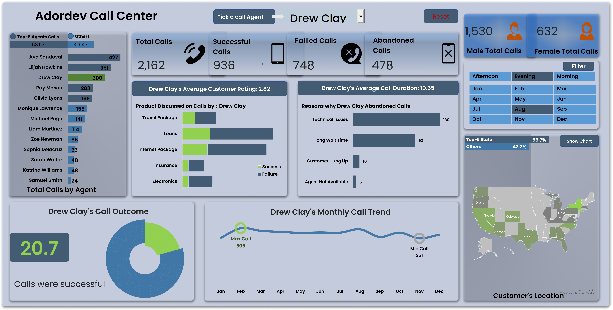
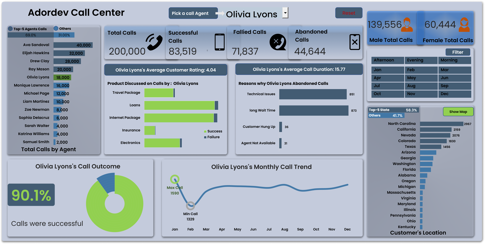

# Adordev Call Center Dashboard

## Introduction
This documentation describes the development and insights of the Adordev Call Center Dashboard. The dashboard was designed in Excel to summarize call performance, track agent activities, and analyze customer behavior. It provides actionable metrics to support decision-making.

## About the Data
The dataset represents call center activities. It includes:
- Total calls made
- Successful calls
- Failed calls
- Abandoned calls
- Calls by agent
- Customer gender distribution
- Customer locations
- Monthly call trends
- Product discussions
- Call outcomes and reasons for failure

## Methodology

### Data Collection
Call records were sourced from the call center’s internal system. Data includes timestamps, agent identifiers, call status, customer demographics, and call outcomes.

### Data Cleaning & Transformation
- Removed duplicate records
- Corrected inconsistent agent names
- Categorized calls into successful, failed, and abandoned
- Standardized customer location data
- Structured product discussions by category

### Exploratory Data Analysis
Explored distribution of calls across agents, gender, and states. Analyzed reasons for abandoned calls. Identified peak calling months.

### Visualisation
Created charts and tables in Excel to highlight key trends:
- Bar charts for calls by agent and customer location
- Line chart for monthly trends
- Donut chart for call outcomes
- Horizontal bar charts for reasons of abandonment

### Statistical Analysis
- Calculated agent success rates
- Derived average call duration
- Measured customer satisfaction ratings

### Interpretation & Recommendations
Data was interpreted to highlight strong and weak areas in call performance. Recommendations were provided to improve efficiency and customer experience.

## Data Model Overview
The model links agents, calls, customers, and products. Metrics are aggregated by agent and customer segments for performance monitoring.

## Analysis
- Ava Sandoval handled the highest calls at 40,000
- Olivia Lyons had 18,000 calls with 90.1% success
- Average customer rating for Olivia Lyons was 4.04
- Technical issues and long wait times were the main reasons for abandoned calls
- North Carolina had the highest call volume at 2,967

## Dashboards

## Insights
- 200,000 total calls, with 83,519 successful and 71,837 failed
- Male customers accounted for 139,556 calls, female for 60,444
- Call success rate was 90.1% for Olivia Lyons
- Long wait times and technical issues caused most abandoned calls
- Travel packages and loans were top discussion topics
- Maximum monthly calls for Olivia Lyons were 1,590 in March

## Recommendations
- Reduce long wait times with better queue management
- Address technical issues with system upgrades
- Provide additional training to low-performing agents
- Focus marketing on high-demand products such as travel packages and loans
- Balance workload across agents to improve efficiency
- Monitor high-call states like North Carolina and California for customer support planning
